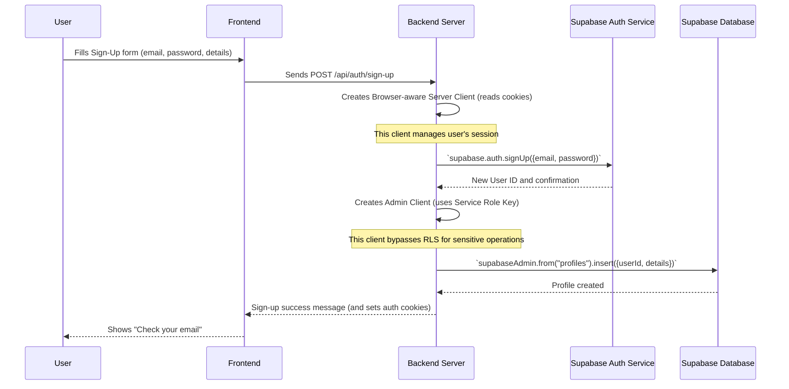

# Chapter 1: Supabase Client & Auth Management

Welcome to the first chapter of our `RoomFinder` tutorial! In this chapter, we'll unravel the mystery of how our app talks to its powerful Supabase backend. Think of Supabase as a secure building where all our app's data lives, including user accounts, room listings, and more. To get things done in this building, we need the right "keys" and "manuals," and that's exactly what **Supabase Client & Auth Management** provides.

## What Problem Does This Solve?

Imagine our `RoomFinder` app needs to let new users **sign up** and existing users **log in**. This means our app needs to:

1.  Send user information (like email and password) to Supabase.
2.  Receive confirmation back from Supabase.
3.  Keep track of who the user is so they can access their saved rooms or manage their listings.

But how do we do this securely? We can't just give everyone the master key! We need different levels of access for different tasks. This is where the concept of different Supabase clients comes in.

## Different "Keys" for Our Secure Building

Just like a secure building has different keys for different people, our `RoomFinder` app uses different types of Supabase clients to interact with the backend:

| Client Type                 | Analogy                                   | What it Does                                                                                                                                                                                                                                                                                                                                             | Best for...                                                                                                                                                                                                                                               |
| :-------------------------- | :---------------------------------------- | :------------------------------------------------------------------------------------------------------------------------------------------------------------------------------------------------------------------------------------------------------------------------------------------------------------------------------------------------------- | :-------------------------------------------------------------------------------------------------------------------------------------------------------------------------------------------------------------------------------------------------------- |
| **Browser-aware Server Client** | **Management Staff Key**                  | This client runs on our backend server (e.g., in API routes). It's smart enough to read and write cookies, which are tiny bits of data that help keep track of a user's session in their browser. This allows it to handle user logins and sign-ups securely on the server, acting on behalf of the user, while managing their session. | Server-side operations that need to know who the current user is, like logging in, signing up, checking user sessions, or accessing user-specific data from your database (respecting security rules).                                                 |
| **Plain Browser Client**    | **General Public Access Key**             | This client runs directly inside the user's web browser. It's used when the user interacts with the app from their computer or phone. It also helps manage user sessions (via cookies) but primarily for actions initiated directly by the user in the browser.                                                                                            | Client-side interactions in your React components, allowing users to perform actions directly from their browser, like updating their profile *after* they are logged in. (Note: Most auth in RoomFinder happens via server routes for security.) |
| **Admin Client**            | **Master Key / Administrator's Key**      | This client also runs on our backend server, but it uses a very special, secret "Service Role Key." This key gives it *full* control over our Supabase project, letting it bypass all security rules. It's used for powerful, sensitive tasks that only an administrator should perform.                                                                   | Backend tasks requiring full control, like creating user profiles immediately after signup, setting up initial data, or performing maintenance tasks that shouldn't be restricted by normal user permissions.                                       |

### Our Use Case: Signing Up a New User

Let's walk through how these different "keys" work together when a new user signs up for `RoomFinder`.

When a user tries to sign up, here's what happens:

1.  The user fills out a form on the `RoomFinder` website (their browser).
2.  This information is sent to a special address on our `RoomFinder` server: `/api/auth/sign-up`.
3.  Our server uses the **Browser-aware Server Client** to tell Supabase to create a new user account.
4.  Once the basic user account is created, our server then uses the powerful **Admin Client** to add more details about this new user (like their first name, last name, and user type) into our `profiles` database table. This step needs the Admin Client because we want to make sure the profile is created correctly, without being blocked by normal user permissions.

Let's look at a simplified version of the code that handles this in `app/api/auth/sign-up/route.ts`.

```typescript
// app/api/auth/sign-up/route.ts (simplified)
import { createClient } from "@/lib/supabase/server" // Our Browser-aware Server Client
import { supabaseAdmin } from "@/lib/supabase/admin" // Our Admin Client

export async function POST(request) {
  const { email, password, firstName, lastName, userType } = await request.json()

  // 1. Use the Browser-aware Server Client for user sign-up
  const supabase = await createClient() // Create our Browser-aware Server Client instance
  const { data: authData, error: authError } = await supabase.auth.signUp({
    email,
    password,
    options: { /* ... more options ... */ },
  })

  if (authError) {
    // Handle error if sign-up fails (e.g., email already exists)
    return NextResponse.json({ error: authError.message }, { status: 400 })
  }

  // 2. Use the Admin Client to create a user profile
  const { error: profileError } = await supabaseAdmin // Use the Admin Client
    .from("profiles") // Access the 'profiles' table
    .insert({
      id: authData.user.id, // Link to the new user's ID
      email,
      first_name: firstName,
      last_name: lastName,
      user_type: userType,
    })

  if (profileError) {
    console.error("[profile insert error]", profileError)
    // Optional: handle profile creation error
  }

  return NextResponse.json({ success: true, message: "Sign up successful." }, { status: 201 })
}
```

In this code:
*   First, we get our `supabase` object using `createClient()` from `lib/supabase/server`. This is our **Browser-aware Server Client**. We use it to call `supabase.auth.signUp()`, which securely creates the user's account in Supabase's authentication system.
*   Next, we use `supabaseAdmin`. This is our pre-configured **Admin Client**. We use it to `insert` the user's `firstName`, `lastName`, and `userType` into the `profiles` table. This step is critical because we want to ensure the profile is always created, even if regular user permissions (called Row Level Security or RLS) might otherwise block it.

This example shows how both a user-focused client and an admin client work together to complete a complex task like user registration!

### What Happens When You Log In?

Let's quickly look at the login process in `app/api/auth/login/route.ts` to see our **Browser-aware Server Client** in action again.

```typescript
// app/api/auth/login/route.ts (simplified)
import { createClient } from "@/lib/supabase/server" // Our Browser-aware Server Client

export async function POST(request) {
  const { email, password } = await request.json()

  const supabase = await createClient() // Get our Browser-aware Server Client

  const { data, error } = await supabase.auth.signInWithPassword({ // Log the user in
    email,
    password,
  })

  if (error) {
    return NextResponse.json({ error: error.message }, { status: 401 })
  }

  return NextResponse.json({ success: true, user: data.user }, { status: 200 })
}
```
Here, `createClient()` from `lib/supabase/server` is again used. This time, it handles the `signInWithPassword` function, which asks Supabase to verify the user's credentials and, if successful, establishes a session by setting secure cookies in the user's browser via our server response.

## Under the Hood: How the Clients Are Made

So, how are these different "keys" actually created? Let's peek into the `lib/supabase` folder.

First, here's a simplified sequence of what happens when a user signs up:



### The Plain Browser Client (`lib/supabase/client.ts`)

This is the most straightforward client. It's meant to run in the user's browser.

```typescript
// lib/supabase/client.ts
import { createBrowserClient } from "@supabase/ssr"

export function createClient() {
  return createBrowserClient(
    process.env.NEXT_PUBLIC_SUPABASE_URL!,
    process.env.NEXT_PUBLIC_SUPABASE_ANON_KEY! // The public key
  )
}
```

This `createClient` function uses `createBrowserClient` from `@supabase/ssr`. It takes your Supabase project URL and a public "anon key." This is the "General Public Access Key" that lets the browser talk to Supabase for basic, non-sensitive tasks or when a user is not logged in.

### The Browser-aware Server Client (`lib/supabase/server.ts`)

This client is a bit more complex because it needs to act like a browser on the server, specifically by managing cookies.

```typescript
// lib/supabase/server.ts
import { createServerClient } from "@supabase/ssr"
import { cookies } from "next/headers" // For reading/writing HTTP cookies

export async function createClient() {
  const cookieStore = await cookies() // Get the cookies from the incoming request

  return createServerClient(
    process.env.NEXT_PUBLIC_SUPABASE_URL!,
    process.env.NEXT_PUBLIC_SUPABASE_ANON_KEY!,
    {
      cookies: {
        getAll() {
          return cookieStore.getAll() // Tell Supabase how to get all cookies
        },
        setAll(cookiesToSet) {
          try {
            // Tell Supabase how to set cookies in the response
            cookiesToSet.forEach(({ name, value, options }) =>
              cookieStore.set(name, value, options)
            )
          } catch {
            // Ignore errors here, this is for server components
          }
        },
      },
    }
  )
}
```

This `createClient` uses `createServerClient`. The key part here is the `cookies` object within the configuration. It tells the Supabase client *how* to interact with HTTP cookies on the server using Next.js's `cookies` function. This is what allows our server to manage user sessions (like logging in and out) securely, mimicking browser behavior without exposing sensitive data to the client. This is the "Management Staff Key" for our server.

### The Admin Client (`lib/supabase/admin.ts`)

This is our "Master Key." It's configured to use a special `SERVICE_ROLE_KEY` that gives it administrative power.

```typescript
// lib/supabase/admin.ts
import { createClient } from "@supabase/supabase-js" // Note: different import for admin client

export const supabaseAdmin = createClient(
  process.env.NEXT_PUBLIC_SUPABASE_URL!, // Your project URL
  process.env.SUPABASE_SERVICE_ROLE_KEY!, // 🔴 This is the secret master key!
  {
    auth: {
      autoRefreshToken: false,
      persistSession: false,
    },
  }
)
```

Here, we use `createClient` from `@supabase/supabase-js` (a slightly different package for this specific type of client). The crucial difference is `process.env.SUPABASE_SERVICE_ROLE_KEY!`. This environment variable holds a highly secret key that should *never* be exposed to the public browser. It allows `supabaseAdmin` to perform actions that bypass all Row Level Security (RLS) policies you might have configured, giving it full control over your database. That's why it's the "Master Key."

## Conclusion

In this chapter, we learned that interacting with Supabase securely requires different types of "keys" or clients. We have:

*   The **Browser-aware Server Client** (like a Management Staff Key) for secure server-side operations involving user authentication and sessions.
*   The **Plain Browser Client** (General Public Access Key) for direct client-side interactions.
*   The **Admin Client** (Master Key) for powerful, server-side administrative tasks that bypass security rules.

Understanding these different clients is fundamental to building secure and functional applications with Supabase. You've now got a grasp on how our `RoomFinder` app talks to its backend securely.

Next up, we'll dive into how we actually manage the room data itself using these clients!

[Next Chapter: Room Data Management API](02_room_data_management_api_.md)

---
