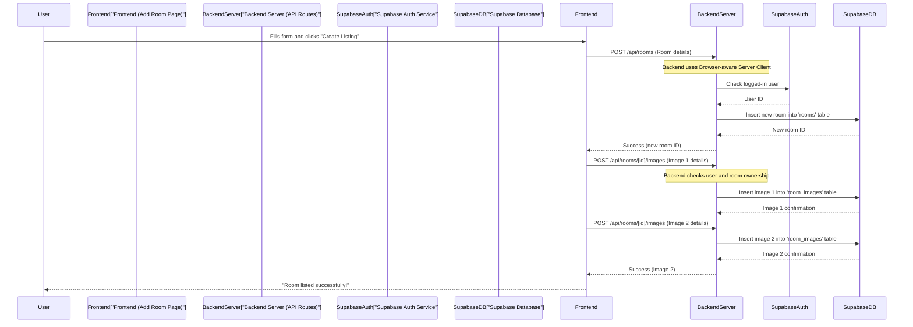

# Chapter 2: Room Data Management API

Welcome back to the `RoomFinder` journey! In our [previous chapter, "Supabase Client & Auth Management"](01_supabase_client___auth_management_.md), we learned about the different "keys" our app uses to talk to the secure Supabase building – the **Browser-aware Server Client**, **Plain Browser Client**, and **Admin Client**. These keys are essential for securely managing who can do what.

Now that we know *how* our app talks to the database, let's dive into *what* it talks about: our room listings! This chapter focuses on the **Room Data Management API**.

## What Problem Does This Solve?

Imagine our `RoomFinder` app as a bustling hotel. The `Room Data Management API` acts like the central reception desk. When someone wants to:

*   **List a new room** (a new room becomes available in the hotel).
*   **Find all available rooms** (check the vacancies board).
*   **See details of a specific room** (ask for information about Room 301).
*   **Update room information** (change the rent for Room 205).
*   **Remove a room listing** (take Room 101 off the market).

All these requests go through our "receptionists" – the `Room Data Management API` endpoints. They ensure that requests are handled correctly, securely, and consistently, always talking to our Supabase database (the hotel's ledger) on the backend.

Let's take a central use case: **Adding a brand new room listing**. How does the app let a room owner submit their room details and get them saved in our database?

## Key Concepts: Our API Receptionists

Our "receptionists" are actually special web addresses on our server called **API Routes**. When you visit a website, your browser usually makes a `GET` request to fetch a page. For managing data, we use different "verbs" or **HTTP Methods**:

| HTTP Method | Analogy                                   | What it Does for Rooms                                   |
| :---------- | :---------------------------------------- | :------------------------------------------------------- |
| **GET**     | **"Show me the rooms."**                  | Retrieves room information (all rooms or a specific one). |
| **POST**    | **"Here's a new room to list!"**          | Creates a brand new room listing.                       |
| **PUT**     | **"Update Room 101's details."**          | Modifies an *existing* room's information.             |
| **DELETE**  | **"Take Room 202 off the market."**       | Removes a room listing.                                 |

These methods tell our server exactly what kind of operation we want to perform on the room data.

### Who is Asking? (Authentication & Authorization)

Just like a hotel receptionist needs to verify your identity before letting you into a room, our API routes need to know who is making the request.

*   **Authentication**: "Are you who you say you are? (e.g., Are you logged in?)" We use our [Browser-aware Server Client](01_supabase_client___auth_management_.md) from Chapter 1 for this.
*   **Authorization**: "Are you *allowed* to do that? (e.g., Are you the owner of this room?)" The API checks if the logged-in user has permission to modify or delete a specific room.

## How We Add a New Room Listing

Let's walk through how a user adds a new room in `RoomFinder`.

### Step 1: The User Fills Out the Form (Frontend)

On the `AddRoomPage` (located at `/dashboard/add-room`), a room owner fills in details like title, location, rent, amenities, and uploads images.

When they click "Create Listing," the app needs to send all this information to our server.

Here's a simplified look at how the `AddRoomPage` (frontend) sends the room data:

```typescript
// app/dashboard/add-room/page.tsx (simplified handleSubmit)
// ... other code ...
const handleSubmit = async (e: React.FormEvent) => {
  e.preventDefault()
  // ... check if user is logged in ...

  try {
    const response = await fetch("/api/rooms", { // <--- This calls our API receptionist!
      method: "POST", // We want to CREATE a new room
      headers: { "Content-Type": "application/json" },
      body: JSON.stringify({
        title: formData.title,
        description: formData.description,
        rentPrice: Number.parseInt(formData.rent_price),
        // ... more room details from the form ...
      }),
    })

    const data = await response.json()

    if (!response.ok) {
      // Handle error if the server says something went wrong
      console.error("Failed to create room:", data.error)
      return
    }

    const roomId = data.room.id // Get the ID of the newly created room

    // After creating the room, we also need to add its images!
    for (let i = 0; i < imageUrls.length; i++) {
      await fetch(`/api/rooms/${roomId}/images`, { // <--- Call another API receptionist!
        method: "POST", // We want to ADD images
        headers: { "Content-Type": "application/json" },
        body: JSON.stringify({
          imageUrl: imageUrls[i],
          displayOrder: i,
        }),
      })
    }

    // Success! Redirect the user
    console.log("Room created successfully!")
    router.push("/dashboard")
  } catch (err) {
    console.error("Error creating room:", err)
  }
}
// ... other code ...
```
In this code, the `fetch("/api/rooms", { method: "POST", ... })` line is the key. It sends all the `formData` to our server at the `/api/rooms` address, asking it to create a new room listing. After the room is created and we get its unique `roomId`, we then send separate requests to `/api/rooms/[roomId]/images` to attach all the uploaded pictures.

### Step 2: The Server Receives the Request (Backend API Route)

Our server has a special "receptionist" waiting at `/api/rooms`. When it receives a `POST` request, it knows it needs to create a new room.

Here's a simplified look at the server-side code that handles creating a new room:

```typescript
// app/api/rooms/route.ts (simplified POST function)
import { createClient } from "@/lib/supabase/server" // Our Browser-aware Server Client
import { NextResponse } from "next/server"

export async function POST(request) {
  const supabase = await createClient() // Get our server client

  // 1. Authenticate the user: "Who is asking to list a room?"
  const { data: { user } } = await supabase.auth.getUser()

  if (!user) { // If no user is logged in
    return NextResponse.json({ error: "Unauthorized" }, { status: 401 })
  }

  const body = await request.json() // Get the room details from the frontend
  const { title, description, location, rentPrice, /* ... more details ... */ } = body

  // (Input validation happens here, skipped for brevity)

  // 2. Insert the new room into our Supabase database
  const { data, error } = await supabase
    .from("rooms") // Go to the 'rooms' table
    .insert({
      title,
      description,
      location,
      rent_price: rentPrice,
      owner_id: user.id, // Link this room to the logged-in user
      // ... more room details ...
    })
    .select() // Ask for the newly inserted room data back
    .single() // Expect only one room back

  if (error) {
    console.error("[API] POST room error:", error)
    return NextResponse.json({ error: error.message }, { status: 500 })
  }

  // 3. Send back the newly created room data to the frontend
  return NextResponse.json({ room: data }, { status: 201 })
}
```
In this code:
1.  We first get our `supabase` client (our "Management Staff Key" from [Chapter 1](01_supabase_client___auth_management_.md)) to check if a user is logged in (`supabase.auth.getUser()`). If not, we send an "Unauthorized" error.
2.  If the user is logged in, we grab the room details from the request body.
3.  Then, we use `supabase.from("rooms").insert(...)` to add the new room to our `rooms` table in the database. Crucially, we link the room to the `user.id` so we know who owns it!
4.  Finally, we send a success message (and the new room's details) back to the frontend.

### Step 3: Handling Room Images

After the main room details are saved, the frontend sends another `POST` request, this time to `/api/rooms/[id]/images`, for each image.

```typescript
// app/api/rooms/[id]/images/route.ts (simplified POST function)
import { createClient } from "@/lib/supabase/server"
import { NextResponse } from "next/server"

export async function POST(request, context) {
  const { id } = await context.params // This is the roomId we just created
  const supabase = await createClient()

  // 1. Authenticate the user
  const { data: { user } } = await supabase.auth.getUser()
  if (!user) return NextResponse.json({ error: "Unauthorized" }, { status: 401 })

  // 2. Authorize: "Is this user the owner of this room?"
  const { data: room, error: fetchError } = await supabase
    .from("rooms")
    .select("owner_id")
    .eq("id", id)
    .single()

  if (fetchError || room?.owner_id !== user.id) {
    return NextResponse.json({ error: "Not authorized" }, { status: 403 })
  }

  // 3. Get image details and insert into 'room_images' table
  const { imageUrl, displayOrder } = await request.json()
  const { data, error } = await supabase
    .from("room_images")
    .insert({
      room_id: id,
      image_url: imageUrl,
      display_order: displayOrder || 0,
    })
    .select()

  if (error) {
    console.error("[API] POST images error:", error)
    return NextResponse.json({ error: error.message }, { status: 500 })
  }

  return NextResponse.json({ image: data[0] }, { status: 201 })
}
```
Here, before adding an image, we first check if the user is logged in, and then (crucially!) if they are the actual `owner_id` of the `room_id` they are trying to add images to. This is **authorization** in action! If they are, we then insert the image URL and display order into the `room_images` table.

## Under the Hood: The Room Creation Flow

Let's visualize the entire process of adding a new room listing:



This diagram shows how the frontend and backend API routes work together, using our Supabase clients to authenticate users, check permissions, and manage the room data in our database.

## Other Room Data Management Operations

Besides creating rooms, our `Room Data Management API` also handles other common operations:

| API Route               | HTTP Method | Purpose                                                                                                                                              | Code Example (Simplified)                                                                                                                                                                                                                                                                                                             |
| :---------------------- | :---------- | :--------------------------------------------------------------------------------------------------------------------------------------------------- | :------------------------------------------------------------------------------------------------------------------------------------------------------------------------------------------------------------------------------------------------------------------------------------------------------------------------------------ |
| `/api/rooms`            | `GET`       | Fetch **all available room listings**. Can include filters like location or price for searching.                                                    | ```typescript // app/api/rooms/route.ts (GET) const { data, error } = await supabase.from("rooms").select("*").eq("is_available", true).order("created_at", { ascending: false }); ```                                                                                                                                                 |
| `/api/rooms/[id]`       | `GET`       | Fetch details for a **specific room** by its unique ID. This is what displays a single room's page.                                                 | ```typescript // app/api/rooms/[id]/route.ts (GET) const { id } = await context.params; const { data, error } = await supabase.from("rooms").select("*, room_images(*)").eq("id", id).single(); ```                                                                                                                               |
| `/api/rooms/[id]`       | `PUT`       | **Update an existing room**. Only the owner of the room can do this. The API route verifies ownership before making changes.                        | ```typescript // app/api/rooms/[id]/route.ts (PUT) // ... verify user and owner_id ... const { data, error } = await supabase.from("rooms").update(body).eq("id", id).select(); ```                                                                                                                                                   |
| `/api/rooms/[id]`       | `DELETE`    | **Remove a room listing**. Again, only the owner can delete their own room. The API route ensures this security.                                    | ```typescript // app/api/rooms/[id]/route.ts (DELETE) // ... verify user and owner_id ... const { error } = await supabase.from("rooms").delete().eq("id", id); ```                                                                                                                                                                 |
| `/api/rooms/[id]/images` | `GET`       | Fetch **images for a specific room**. Used to display all pictures associated with a room listing.                                                   | ```typescript // app/api/rooms/[id]/images/route.ts (GET) const { id } = await context.params; const { data, error } = await supabase.from("room_images").select("*").eq("room_id", id).order("display_order", { ascending: true }); ```                                                                                             |
| `/api/rooms/[id]/images` | `POST`      | **Add new images** to an existing room. This is similar to the example we saw, where the owner can upload more photos after the initial listing. | ```typescript // app/api/rooms/[id]/images/route.ts (POST) // ... verify user and owner_id ... const { data, error } = await supabase.from("room_images").insert({ room_id: id, image_url: imageUrl }).select(); ```                                                                                                                  |

Each of these API routes acts as a specific "receptionist" that knows exactly how to handle its task, whether it's showing all rooms, showing one room, or performing updates and deletions, always with a careful check on who is asking.

## Conclusion

In this chapter, you've learned about the `Room Data Management API` – the "receptionists" of our `RoomFinder` app that handle all operations related to room listings. We explored how new rooms are created using `POST` requests, how authentication and authorization are vital for security, and how different HTTP methods are used for different data operations.

You now understand how `RoomFinder` creates, reads, updates, and deletes room data securely. Next, we'll dive deeper into how `RoomFinder` manages users, their sign-ups, and profiles.

[Next Chapter: User Authentication & Profiles](03_user_authentication___profiles_.md)

---

<sub><sup>Generated by [AI Codebase Knowledge Builder](https://github.com/The-Pocket/Tutorial-Codebase-Knowledge).</sup></sub> <sub><sup>**References**: [[1]](https://github.com/Akshith1413/RoomFinder/blob/88538c9dc512e91903cccb8a17d1f005655edeb8/app/api/rooms/[id]/images/route.ts), [[2]](https://github.com/Akshith1413/RoomFinder/blob/88538c9dc512e91903cccb8a17d1f005655edeb8/app/api/rooms/[id]/route.ts), [[3]](https://github.com/Akshith1413/RoomFinder/blob/88538c9dc512e91903cccb8a17d1f005655edeb8/app/api/rooms/route.ts), [[4]](https://github.com/Akshith1413/RoomFinder/blob/88538c9dc512e91903cccb8a17d1f005655edeb8/app/dashboard/add-room/page.tsx), [[5]](https://github.com/Akshith1413/RoomFinder/blob/88538c9dc512e91903cccb8a17d1f005655edeb8/app/dashboard/edit-room/[id]/page.tsx)</sup></sub>