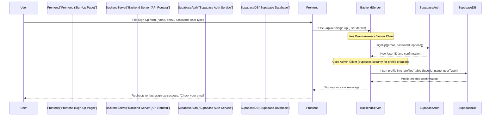

# Chapter 3: User Authentication & Profiles

Welcome back to `RoomFinder`! In our [previous chapter, "Room Data Management API"](02_room_data_management_api_.md), we learned how our app handles all the room listings, from creating new ones to fetching details. Before that, in [Chapter 1, "Supabase Client & Auth Management"](01_supabase_client___auth_management_.md), we explored the different "keys" our app uses to talk to the Supabase backend securely.

Now, it's time to put those keys to work for the most important users: **you!** This chapter is all about **User Authentication & Profiles**.

## What Problem Does This Solve?

Think of `RoomFinder` as a private club. You need an "ID card" to get in, and the club needs to know who you are and what kind of membership you have (e.g., a "Room Finder" looking for rooms, or a "Room Owner" listing rooms).

**User Authentication & Profiles** handles all of this:

1.  **Signing Up**: Letting new people join the club and get their first ID card.
2.  **Logging In**: Proving you're an existing member to enter.
3.  **Staying Logged In**: Remembering you, so you don't have to show your ID every time you move between rooms in the club.
4.  **User Profiles**: Storing your personal details (like your name and membership type) so the club knows what features to offer you.

A central use case for this is **when a new user wants to sign up** and create their very own account on `RoomFinder`. How does the app let them do that securely and store their details?

## Key Concepts: Your Digital ID Card

### 1. Authentication: Proving Who You Are

Authentication is like showing your ID. It's the process of verifying a user's identity. In `RoomFinder`, this happens when you:
*   **Sign Up**: You provide an email and password to create a new identity.
*   **Log In**: You provide your existing email and password to prove you are who you say you are.

### 2. Authorization: What You Can Do

Authorization comes *after* authentication. Once the app knows *who* you are, it then checks *what you're allowed to do*. For example:
*   A "Room Owner" can list rooms.
*   A "Room Finder" can save rooms.
*   Neither can do the other's special tasks unless they have both memberships (user types).

### 3. User Profiles: Your Membership Details

While Supabase's authentication system knows your email and password, our `RoomFinder` app often needs more details, like your first name, last name, and whether you are a "finder" or an "owner." These extra details are stored in a **user profile** in our database, linked to your Supabase authentication ID.

## How We Sign Up a New User

Let's trace the journey of a new user signing up for `RoomFinder`.

### Step 1: The User Fills the Sign-Up Form (Frontend)

A new user visits the `/auth/sign-up` page and fills out a form with their name, email, password, and chooses if they are a "Room Finder" or "Room Owner."

When they click "Create Account," the frontend sends this information to our server.

Here’s a simplified look at the frontend code (`app/auth/sign-up/page.tsx`) that handles this:

```typescript
// app/auth/sign-up/page.tsx (simplified handleSignUp)
// ... other imports and state ...

const handleSignUp = async (e: React.FormEvent) => {
  e.preventDefault()
  setIsLoading(true)
  setError(null)

  if (formData.password !== formData.repeatPassword) {
    setError("Passwords do not match")
    setIsLoading(false)
    return
  }

  try {
    // Send user details to our backend API for sign-up
    const response = await fetch("/api/auth/sign-up", {
      method: "POST",
      headers: { "Content-Type": "application/json" },
      body: JSON.stringify(formData), // All form data like email, password, name, userType
    })

    const data = await response.json()

    if (!response.ok) {
      setError(data.error || "Sign up failed")
      return
    }

    // Success! Redirect user to a success page
    router.push("/auth/sign-up-success")
  } catch (err) {
    setError(err instanceof Error ? err.message : "An error occurred")
  } finally {
    setIsLoading(false)
  }
}

// ... other component JSX ...
```
In this code, when the user submits the form, the `fetch("/api/auth/sign-up", ...)` line sends all the user's input to our backend server. Our server will then handle creating the user account and their profile.

### Step 2: The Server Creates the User and Profile (Backend API Route)

Our server has a special API route, `/api/auth/sign-up`, that listens for `POST` requests. When it receives the user's sign-up data, it performs two main tasks:

1.  **Creates the user's authentication account** in Supabase.
2.  **Creates the user's profile** in our database, storing additional details.

Let's look at a simplified version of `app/api/auth/sign-up/route.ts`:

```typescript
// app/api/auth/sign-up/route.ts (simplified POST function)
import { createClient } from "@/lib/supabase/server" // Our Browser-aware Server Client
import { supabaseAdmin } from "@/lib/supabase/admin" // Our Admin Client

export async function POST(request) {
  const { email, password, firstName, lastName, userType } = await request.json()
  // ... input validation ...

  // 1. Use the Browser-aware Server Client to create the user's auth account
  const supabase = await createClient()
  const { data: authData, error: authError } = await supabase.auth.signUp({
    email,
    password,
    options: { /* ... email verification setup ... */ },
  })

  if (authError) {
    return NextResponse.json({ error: authError.message }, { status: 400 })
  }
  if (!authData.user) { // No user object means sign-up failed
    return NextResponse.json({ error: "User creation failed" }, { status: 500 })
  }

  // 2. Use the Admin Client to create the user's profile in our database
  const { error: profileError } = await supabaseAdmin // Use the powerful Admin Client
    .from("profiles") // Access the 'profiles' table directly
    .insert({
      id: authData.user.id, // Link this profile to the new user's unique ID
      email,
      first_name: firstName,
      last_name: lastName,
      user_type: userType,
    })

  if (profileError) {
    console.error("[profile insert error]", profileError)
    // In a real app, you might want to handle this more robustly
  }

  return NextResponse.json({ success: true, message: "Sign up successful. Please check your email." }, { status: 201 })
}
```
In this code:
*   First, we use `createClient()` (our [Browser-aware Server Client](01_supabase_client___auth_management_.md)) to call `supabase.auth.signUp()`. This function talks to Supabase's authentication service to create the user with their email and password. It also handles sending a confirmation email to the user.
*   Once the basic user account is created, we use `supabaseAdmin` (our powerful [Admin Client](01_supabase_client___auth_management_.md)). This client has special "master keys" and can bypass any security rules to ensure the user's `profiles` entry is created correctly, linking it directly to the new `authData.user.id`. This `profiles` table stores additional details like `first_name`, `last_name`, and `user_type`.
*   Finally, the server sends a success message back to the frontend.

### Step 3: Success! (Frontend Success Page)

After the backend successfully creates the account, the user is redirected to a success page (`app/auth/sign-up-success/page.tsx`). This page informs them to check their email for verification, completing the sign-up process.

## How We Log In an Existing User

Once a user has signed up, they need to log in to access specific features.

### Step 1: The User Enters Credentials (Frontend)

The user goes to the `/auth/login` page and enters their registered email and password.

```typescript
// app/auth/login/page.tsx (simplified handleLogin)
// ... other imports and state ...

const handleLogin = async (e: React.FormEvent) => {
  e.preventDefault()
  setIsLoading(true)
  setError(null)

  try {
    // Send login credentials to our backend API
    const response = await fetch("/api/auth/login", {
      method: "POST",
      headers: { "Content-Type": "application/json" },
      body: JSON.stringify(formData), // Email and password
    })

    const data = await response.json()

    if (!response.ok) {
      setError(data.error || "Login failed")
      return
    }

    // Success! Redirect to home and refresh session
    router.push("/")
    router.refresh() // Tells Next.js to re-fetch user session
  } catch (err) {
    setError(err instanceof Error ? err.message : "An error occurred")
  } finally {
    setIsLoading(false)
  }
}

// ... other component JSX ...
```
Similar to sign-up, the frontend makes a `POST` request to `/api/auth/login` with the email and password.

### Step 2: The Server Authenticates (Backend API Route)

The `/api/auth/login` API route handles the login request.

```typescript
// app/api/auth/login/route.ts (simplified POST function)
import { createClient } from "@/lib/supabase/server" // Our Browser-aware Server Client

export async function POST(request) {
  const { email, password } = await request.json()
  // ... input validation ...

  const supabase = await createClient() // Get our Browser-aware Server Client

  // Use the client to sign in the user with email and password
  const { data, error } = await supabase.auth.signInWithPassword({
    email,
    password,
  })

  if (error) {
    return NextResponse.json({ error: error.message }, { status: 401 })
  }

  // If successful, Supabase sets secure cookies via the server response
  return NextResponse.json({ success: true, user: data.user }, { status: 200 })
}
```
Here, our `createClient()` (the [Browser-aware Server Client](01_supabase_client___auth_management_.md)) is used to call `supabase.auth.signInWithPassword()`. If the credentials are correct, Supabase creates a user session and sets secure cookies in the user's browser, allowing them to stay logged in. The server then sends a success response.

## Managing User Profiles: Viewing and Updating Your Details

Beyond just logging in, users often want to see or change their profile information.

### Fetching Your Profile

To show a user their profile (e.g., on a "My Profile" page), the app makes a `GET` request to `/api/profile`.

```typescript
// app/api/profile/route.ts (simplified GET function)
import { createClient } from "@/lib/supabase/server"

export async function GET(request) {
  const supabase = await createClient()
  const { data: { user } } = await supabase.auth.getUser() // Get the logged-in user

  if (!user) { // If no user is logged in, they can't fetch a profile
    return NextResponse.json({ error: "Unauthorized" }, { status: 401 })
  }

  // Fetch the user's profile from the 'profiles' table
  const { data, error } = await supabase
    .from("profiles")
    .select("*")
    .eq("id", user.id) // Get the profile that matches the logged-in user's ID
    .single()

  if (error) {
    return NextResponse.json({ error: error.message }, { status: 500 })
  }

  return NextResponse.json({ profile: data }, { status: 200 })
}
```
This API route first checks if a user is logged in using `supabase.auth.getUser()`. If so, it fetches their profile details (first name, last name, user type, etc.) from the `profiles` table, matching the `id` with the logged-in `user.id`.

### Updating Your Profile

Users might want to update their name or user type. This is done with a `PUT` request to `/api/profile`.

```typescript
// app/api/profile/route.ts (simplified PUT function)
import { createClient } from "@/lib/supabase/server"

export async function PUT(request) {
  const supabase = await createClient()
  const { data: { user } } = await supabase.auth.getUser()

  if (!user) { // Only logged-in users can update their profile
    return NextResponse.json({ error: "Unauthorized" }, { status: 401 })
  }

  const body = await request.json() // Get the updated profile data

  // Update the user's profile in the 'profiles' table
  const { data, error } = await supabase
    .from("profiles")
    .update(body) // Apply the changes from the request body
    .eq("id", user.id) // Only update the profile matching the logged-in user's ID
    .select()

  if (error) {
    return NextResponse.json({ error: error.message }, { status: 500 })
  }

  return NextResponse.json({ profile: data[0] }, { status: 200 })
}
```
Similar to fetching, the `PUT` route first verifies the user. Then, it takes the updated information from the request body and uses `supabase.from("profiles").update(body).eq("id", user.id)` to modify only *their own* profile in the database.

## Under the Hood: User Authentication Flow

Let's visualize the entire sign-up process from a user's perspective, combining what we've learned:



This diagram shows how the user interacts with the frontend, which then communicates with the backend API. The backend orchestrates calls to both Supabase's authentication service and our database, making sure both the core user account and the additional profile details are created securely.

## Logging Out

Finally, what about logging out? When a user clicks "Logout" in our `Navigation` component (`components/navigation.tsx`), the frontend directly calls Supabase to end the session.

```typescript
// components/navigation.tsx (simplified handleLogout)
// ... other imports ...

export default function Navigation({ user }: { user: User | null }) {
  // ... other state and functions ...
  const supabase = createClient() // Our Plain Browser Client

  const handleLogout = async () => {
    await supabase.auth.signOut() // Call Supabase to log out
    router.refresh() // Tell Next.js to update the UI
    setIsOpen(false)
  }

  // ... component JSX ...
}
```
Here, we use `createClient()` from `lib/supabase/client.ts`, which is our [Plain Browser Client](01_supabase_client___auth_management_.md). It directly calls `supabase.auth.signOut()`, which tells Supabase to invalidate the user's session and clear the authentication cookies from the browser.

## Summary of Authentication & Profile API Routes

| API Route          | HTTP Method | Purpose                                                                 |
| :----------------- | :---------- | :---------------------------------------------------------------------- |
| `/api/auth/sign-up` | `POST`      | Creates a new user account and their initial profile.                 |
| `/api/auth/login`  | `POST`      | Authenticates an existing user and establishes their session.           |
| `/api/profile`     | `GET`       | Fetches the currently logged-in user's profile details.                 |
| `/api/profile`     | `PUT`       | Updates the currently logged-in user's profile details.                 |
| (No direct API for logout) |         | Logout is handled directly by the frontend using `supabase.auth.signOut()`. |

## Conclusion

In this chapter, you've learned how `RoomFinder` manages **User Authentication & Profiles**. We covered the journey from signing up and logging in, to viewing and updating user-specific details. We saw how different Supabase clients (the [Browser-aware Server Client](01_supabase_client___auth_management_.md), [Admin Client](01_supabase_client___auth_management_.md), and [Plain Browser Client](01_supabase_client___auth_management_.md)) work together to ensure a secure and personalized user experience.

You now understand how `RoomFinder` handles its "ID office," ensuring users are identified and their specific roles are recognized. Next, we'll dive into how users can browse and search for rooms!

[Next Chapter: Room Browsing & Search](04_room_browsing___search_.md)

---