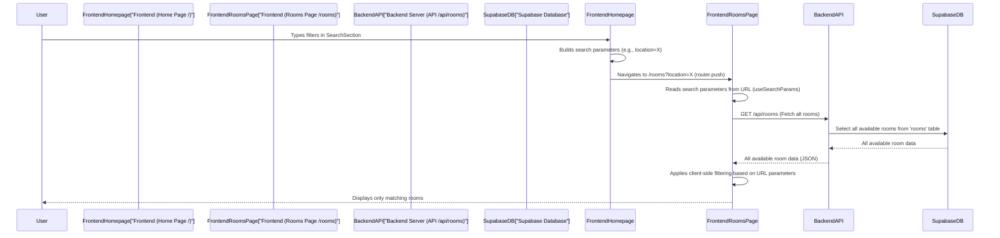

# Chapter 4: Room Browsing & Search

Welcome back, RoomFinder explorers! In our [previous chapter, "User Authentication & Profiles"](03_user_authentication___profiles_.md), we learned how users can sign up, log in, and manage their personal details. Before that, we covered how our app talks to the database and handles room listings.

Now that we have rooms listed and users authenticated, it's time to connect the dots: how do users **find** those rooms? This chapter is all about **Room Browsing & Search**.

## What Problem Does This Solve?

Imagine `RoomFinder` as a giant library filled with millions of books (our room listings). Without a good system, finding a specific book would be impossible! **Room Browsing & Search** is like the library's well-organized catalog system. It lets users:

1.  **See all available rooms** (browse the main shelves).
2.  **Quickly find a specific type of room** (use the search engine and filters).

Our central use case for this chapter is straightforward: **A user wants to find a room that fits their specific needs.** How does `RoomFinder` allow them to look through all the listings and narrow down their choices, perhaps finding a "2 BHK in Mumbai under ₹20,000 for a family"?

## Key Concepts: Your Personal Room Catalog

To make finding rooms easy, `RoomFinder` uses a few key ideas:

### 1. The Main Room Listings Page (`/rooms`)

This is the heart of the browsing experience. It's like walking into the main hall of our "real estate catalog." Here, `RoomFinder` displays all available rooms, often showing a picture, title, location, and price for each. It's designed to give you a quick overview of what's out there.

### 2. The Powerful Search Bar

Located prominently on our home page and the `/rooms` page, the search bar is where you start telling `RoomFinder` what you're looking for. You can type in a general **location**, and the app will start looking for matches.

### 3. Smart Filters

Below the search bar (or sometimes alongside it), `RoomFinder` offers **filters**. These are like specific criteria you can check off in your catalog to instantly narrow down your search. Instead of just a broad "search," filters let you specify:
*   **Location:** (e.g., "Bandra," "Kolkata")
*   **Price Range:** (e.g., "Min ₹10,000, Max ₹25,000")
*   **Property Type:** (e.g., "1 BHK," "Studio Apartment," "2 Bed")
*   **Tenant Preference:** (e.g., "Family," "Bachelors," "Girls")

By combining these, you can drill down to exactly what you need.

## How We Find Rooms: A Guided Tour

Let's walk through how a user finds their perfect room in `RoomFinder`, step-by-step.

### Step 1: Searching from the Home Page (Frontend)

When you first open `RoomFinder`, you see a `SearchSection` on the main `/` page. This is your initial gateway to finding rooms.

Here's how the `SearchSection` component (`components/search-section.tsx`) collects your input:

```typescript
// components/search-section.tsx (simplified)
import { useState } from "react"
import { useRouter } from "next/navigation" // To navigate to other pages

export default function SearchSection() {
  const router = useRouter()
  const [location, setLocation] = useState("")
  const [priceMin, setPriceMin] = useState("")
  // ... more state for priceMax, propertyType, tenantPref ...

  const handleSearch = (e: React.FormEvent) => {
    e.preventDefault()
    const params = new URLSearchParams() // This helps build the URL filters
    if (location) params.append("location", location)
    if (priceMin) params.append("priceMin", priceMin)
    // ... append other filters if they have values ...

    // Navigate to the /rooms page with our search filters in the URL
    router.push(`/rooms?${params.toString()}`)
  }

  return (
    <form onSubmit={handleSearch}> {/* When you click 'Search Rooms' */}
      <Input
        placeholder="Enter location..."
        value={location}
        onChange={(e) => setLocation(e.target.value)}
      />
      <Input
        type="number"
        placeholder="Min Price"
        value={priceMin}
        onChange={(e) => setPriceMin(e.target.value)}
      />
      {/* ... more filter inputs ... */}
      <Button type="submit">Search Rooms</Button>
    </form>
  )
}
```
In this code:
*   We use `useState` to keep track of what the user types into each input field (like `location`, `priceMin`).
*   When the "Search Rooms" button is clicked (`handleSearch`), we create a `URLSearchParams` object. This object helps us build a neat list of filters (like `location=Mumbai&priceMin=10000`).
*   Finally, `router.push(`/rooms?${params.toString()}`)` navigates you to the `/rooms` page. Critically, it attaches your search terms directly into the URL! For example, if you searched for "Mumbai" with a minimum price of "10000", the URL would become `/rooms?location=Mumbai&priceMin=10000`.

### Step 2: Displaying and Filtering Rooms (Frontend)

Now that the URL contains your search criteria, the `RoomsPage` component (`app/rooms/page.tsx`) takes over. This page is responsible for fetching all rooms and then applying your chosen filters.

```typescript
// app/rooms/page.tsx (simplified)
"use client" // This is a client-side component

import { useEffect, useState } from "react"
import { useSearchParams } from "next/navigation" // To read URL filters
import { createClient } from "@/lib/supabase/client" // Our Plain Browser Client
import Navigation from "@/components/navigation"

export default function RoomsPage() {
  const searchParams = useSearchParams() // Get the filters from the URL
  const [rooms, setRooms] = useState<Room[]>([])
  const [filteredRooms, setFilteredRooms] = useState<Room[]>([])
  const [isLoading, setIsLoading] = useState(true)

  // Get filter values from the URL
  const location = searchParams.get("location") || ""
  const priceMin = searchParams.get("priceMin") || ""
  // ... get other filter values ...

  const supabase = createClient() // Our client to talk to Supabase

  useEffect(() => {
    const fetchData = async () => {
      // 1. Fetch ALL rooms from our API
      const response = await fetch("/api/rooms") // Call our Room Data Management API
      const data = await response.json()
      if (data.rooms) {
        setRooms(data.rooms) // Store all fetched rooms
      }
      setIsLoading(false)
    }
    fetchData()
  }, []) // Run once when the page loads

  // 2. Apply filters whenever rooms or filter values change
  useEffect(() => {
    let currentFiltered = rooms // Start with all rooms

    if (location) {
      currentFiltered = currentFiltered.filter((r) =>
        r.location.toLowerCase().includes(location.toLowerCase())
      )
    }
    if (priceMin) {
      currentFiltered = currentFiltered.filter((r) => r.rent_price >= Number.parseInt(priceMin))
    }
    // ... apply filters for priceMax, propertyType, tenantPref ...

    setFilteredRooms(currentFiltered) // Update the list of rooms shown to the user
  }, [rooms, location, priceMin, searchParams]) // Re-run when these values change

  return (
    <main>
      <Navigation user={null} />
      {/* Filter UI (similar to SearchSection but on this page) */}
      <Input
        placeholder="📍 Location"
        value={location} // Pre-filled from URL
        onChange={(e) => { /* Update URL with new filter */ }}
      />
      {/* ... more filter inputs ... */}

      {isLoading ? (
        <p>Loading rooms...</p>
      ) : filteredRooms.length === 0 ? (
        <p>No rooms found. Try clearing filters!</p>
      ) : (
        <div className="grid grid-cols-1 md:grid-cols-3 gap-6">
          {filteredRooms.map((room, idx) => (
            <Link key={room.id} href={`/rooms/${room.id}`}>
              {/* Card component displays room details */}
              <Card>
                
                <h3>{room.title}</h3>
                <p>📍 {room.location}</p>
                <span>₹{room.rent_price.toLocaleString()}</span>
                {/* ... other details ... */}
              </Card>
            </Link>
          ))}
        </div>
      )}
    </main>
  )
}
```
In this code:
1.  `useSearchParams()` is a special Next.js hook that reads the filter values directly from the URL. So, if the URL is `/rooms?location=Mumbai`, `location` will automatically be "Mumbai".
2.  The first `useEffect` fetches *all* rooms from our `/api/rooms` endpoint. (Remember from [Chapter 2: Room Data Management API](02_room_data_management_api_.md), this API simply returns all available rooms).
3.  The second `useEffect` is where the filtering magic happens! It takes the `rooms` (all of them) and systematically checks each room against the `location`, `priceMin`, `priceMax`, `propertyType`, and `tenantPref` values obtained from the URL. It then updates `filteredRooms` to show only the matching ones.
4.  The page then displays the `filteredRooms` in nice `Card` components, each linking to a more detailed room page (`/rooms/[id]`).

### Featured Rooms (on Home Page)

Even on the main home page (`/`), we have a `FeaturedRooms` section (`components/featured-rooms.tsx`). This component works similarly but is simpler – it just fetches a small number of available rooms to highlight them.

```typescript
// components/featured-rooms.tsx (simplified)
"use client"

import { useEffect, useState } from "react"
import { createClient } from "@/lib/supabase/client" // Our Plain Browser Client
import Link from "next/link"

export default function FeaturedRooms() {
  const [rooms, setRooms] = useState<Room[]>([])
  const [isLoading, setIsLoading] = useState(true)

  useEffect(() => {
    const fetchRooms = async () => {
      const supabase = createClient() // Get our client to talk to Supabase
      const { data, error } = await supabase
        .from("rooms") // Go to the 'rooms' table
        .select(`id, title, location, rent_price, room_images(image_url)`) // Select specific columns
        .eq("is_available", true) // Only show available rooms
        .limit(6) // Get only 6 rooms

      if (!error && data) {
        setRooms(data)
      }
      setIsLoading(false)
    }

    fetchRooms()
  }, []) // Run once when the component mounts

  if (isLoading) return <p>Loading featured rooms...</p>

  return (
    <section>
      <h2>Featured Rooms</h2>
      <div className="grid">
        {rooms.map((room) => (
          <Link key={room.id} href={`/rooms/${room.id}`}>
            {/* Display each featured room */}
            <Card> {/* ... room details ... */} </Card>
          </Link>
        ))}
      </div>
    </section>
  )
}
```
This component directly uses our [Plain Browser Client](01_supabase_client___auth_management_.md) to query Supabase for a limited number of `is_available` rooms, then displays them. There are no filters applied here, just a simple display of highlighted listings.

## Under the Hood: The Room Finding Flow

Let's visualize the process when a user searches for a room from the Home Page:



This diagram shows that the search *input* happens on the `FrontendHomepage`, but the *filtering* and *display* of results happen on the `FrontendRoomsPage`. The backend (`BackendAPI`) simply provides *all* the rooms, and the frontend does the job of sifting through them based on the user's filters.

## Summary of Room Browsing & Search Features

| Feature           | Description                                                                     | Frontend Components Involved        | How it Works                                                                                                                                      |
| :---------------- | :------------------------------------------------------------------------------ | :---------------------------------- | :------------------------------------------------------------------------------------------------------------------------------------------------ |
| **Main Listing**  | Displays all room listings in a gallery format.                                 | `app/rooms/page.tsx`                | Fetches all rooms from `/api/rooms` and renders them.                                                                                             |
| **Search Bar**    | Allows users to input text (e.g., location) to find rooms.                      | `components/search-section.tsx`     | Collects input, builds URL parameters, and navigates to `/rooms`.                                                                                 |
| **Filters**       | Provides specific criteria (price, type, tenant) to narrow down choices.        | `components/search-section.tsx`, `app/rooms/page.tsx` | `useSearchParams` reads filters from the URL. `useEffect` then filters the `rooms` state array on the client-side before displaying them. |
| **Featured Rooms** | Shows a curated selection of rooms on the home page.                            | `components/featured-rooms.tsx`     | Uses [Plain Browser Client](01_supabase_client___auth_management_.md) to fetch a limited set of rooms directly from Supabase.                  |

## Conclusion

In this chapter, you've learned how `RoomFinder` makes it easy for users to discover rooms through **Room Browsing & Search**. We explored how the search bar and powerful filters collect user preferences, how these preferences are passed through the URL, and how the `RoomsPage` efficiently fetches all listings and then filters them to display only what the user wants.

You now understand how `RoomFinder` acts as a highly organized "real estate catalog." Next, we'll look at a handy feature that lets users keep track of rooms they like: saving them!

[Next Chapter: Saved Rooms Functionality](05_saved_rooms_functionality_.md)

---

<sub><sup>Generated by [AI Codebase Knowledge Builder](https://github.com/The-Pocket/Tutorial-Codebase-Knowledge).</sup></sub> <sub><sup>**References**: [[1]](https://github.com/Akshith1413/RoomFinder/blob/88538c9dc512e91903cccb8a17d1f005655edeb8/app/page.tsx), [[2]](https://github.com/Akshith1413/RoomFinder/blob/88538c9dc512e91903cccb8a17d1f005655edeb8/app/rooms/page.tsx), [[3]](https://github.com/Akshith1413/RoomFinder/blob/88538c9dc512e91903cccb8a17d1f005655edeb8/components/featured-rooms.tsx), [[4]](https://github.com/Akshith1413/RoomFinder/blob/88538c9dc512e91903cccb8a17d1f005655edeb8/components/search-section.tsx)</sup></sub>