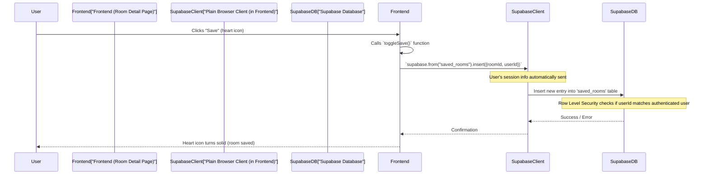
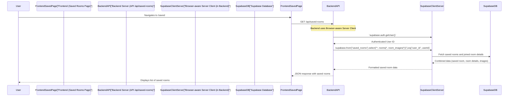

# Chapter 5: Saved Rooms Functionality

Welcome back, `RoomFinder` explorers! In our [previous chapter, "Room Browsing & Search"](04_room_browsing___search_.md), we learned how to efficiently find rooms using search bars and filters. You can browse through countless listings, but what if you find a few you really like and want to keep track of them without having to search all over again?

This chapter introduces the **Saved Rooms Functionality**, which is all about keeping your favorite room listings just a click away!

## What Problem Does This Solve?

Imagine you're online shopping for a new gadget. You might browse many items, add a few to your "wishlist" or "favorites," and then come back later to compare them or decide which one to buy.

The **Saved Rooms Functionality** in `RoomFinder` does exactly that for accommodations! It acts like your personal "wishlist" or "favorites folder" for rooms. This feature solves the problem of:

1.  **Losing track of interesting rooms:** No more endlessly searching for that perfect apartment you saw last week.
2.  **Difficulty comparing options:** Keep all your top choices in one place for easy review.
3.  **Wasted time:** Revisit rooms quickly without re-applying search filters.

Our central use case for this chapter is: **A user finds a room they like, "bookmarks" it, and then later views all their bookmarked rooms on a dedicated page.**

## Key Concepts: Your Personal Room Wishlist

To make saving rooms a breeze, `RoomFinder` uses a few simple ideas:

### 1. The "Wishlist" Button (Heart Icon)

On every room's detail page or even on the main browsing page, you'll see a small "heart" icon. This is your "Add to Wishlist" button! Clicking it tells `RoomFinder` that you're interested in that room. If the heart is already filled, it means you've saved it, and clicking it again will "unsave" it.

### 2. The `saved_rooms` Table in Our Database

Just like how our `rooms` table stores all the room listings (remember [Chapter 2: Room Data Management API](02_room_data_management_api_.md)), we need a special place to store which user likes which room. This is handled by a new table in our Supabase database called `saved_rooms`.

This table is super simple: it just records a link between a specific `user_id` (from the logged-in user) and a `room_id` (from the room they saved).

### 3. Only for Logged-In Users (Authentication Reminder)

Just like only you can see your own personal wishlist in an online store, only **authenticated (logged-in) users** can save rooms in `RoomFinder`. This ensures your saved list is private and secure. (If you need a refresher on how users log in, check out [Chapter 3: User Authentication & Profiles](03_user_authentication___profiles_.md)).

## How to Use Saved Rooms: A User's Journey

Let's see how a user would interact with the Saved Rooms functionality.

### Step 1: Saving a Room from the Room Details Page

Imagine you're on a room's detail page (e.g., `/rooms/clsd...`). You see the images and description, and you decide you want to save it.

The `RoomDetailPage` component (`app/rooms/[id]/page.tsx`) displays the room's information and includes an `ImageGallery` component at the top. This `ImageGallery` has the "heart" button.

Here's how the `RoomDetailPage` manages saving and unsaving:

```typescript
// app/rooms/[id]/page.tsx (simplified toggleSave function)
// ... (imports and state omitted for brevity) ...

export default function RoomDetailPage() {
  // ... (other state, useEffects, and component logic) ...

  const toggleSave = async () => {
    if (!user) { // Check if the user is logged in
      // If not logged in, prompt them to log in (actual app might redirect)
      alert("Please log in to save rooms!")
      return
    }

    if (isSaved) {
      // If already saved, unsave it (delete from saved_rooms table)
      await supabase.from("saved_rooms").delete().eq("room_id", roomId).eq("user_id", user.id)
      setIsSaved(false) // Update the UI state
    } else {
      // If not saved, save it (insert into saved_rooms table)
      await supabase.from("saved_rooms").insert({ room_id: roomId, user_id: user.id })
      setIsSaved(true) // Update the UI state
    }
  }

  // ... (JSX for rendering the page) ...
  return (
    <main>
      {/* ... other parts of the page ... */}
      <ImageGallery images={room.room_images} isSaved={isSaved} onToggleSave={toggleSave} />
      {/* ... rest of room details ... */}
    </main>
  )
}
```
In this code:
*   The `toggleSave` function is called when the heart button is clicked.
*   It first checks if a `user` is logged in. If not, it warns the user.
*   Then, it checks the `isSaved` state. If the room is already saved, it calls `supabase.from("saved_rooms").delete()` to remove it from the database.
*   If the room is *not* saved, it calls `supabase.from("saved_rooms").insert()` to add a new entry to the database, linking the `room_id` to the `user.id`.
*   Finally, it updates the `isSaved` state to reflect the change, which makes the heart icon change its appearance.

### Step 2: Viewing All Your Saved Rooms

After saving a few rooms, you'll want to see them all in one place! `RoomFinder` has a dedicated "Saved Rooms" page (at `/saved`) for this.

The `SavedRoomsPage` component (`app/saved/page.tsx`) is responsible for fetching and displaying all the rooms you've bookmarked.

```typescript
// app/saved/page.tsx (simplified useEffect for fetching saved rooms)
// ... (imports and state omitted for brevity) ...

export default function SavedRoomsPage() {
  const router = useRouter()
  const [user, setUser] = useState<User | null>(null)
  const [savedRooms, setSavedRooms] = useState<SavedRoom[]>([])
  const [isLoading, setIsLoading] = useState(true)

  const supabase = createClient() // Our Plain Browser Client

  useEffect(() => {
    const fetchData = async () => {
      const { data: { user: authUser } } = await supabase.auth.getUser()

      if (!authUser) { // If user is not logged in, redirect them
        router.push("/auth/login")
        return
      }
      setUser(authUser)

      // Fetch saved rooms using our Supabase client
      const { data, error } = await supabase
        .from("saved_rooms") // Look in the 'saved_rooms' table
        .select(` // Select data, and also details from the 'rooms' and 'room_images' tables
          id,
          room_id,
          rooms(id, title, location, rent_price, property_type, tenant_preference, room_images(image_url))
        `)
        .eq("user_id", authUser.id) // ONLY fetch saved rooms for the current user
        .order("created_at", { ascending: false })

      if (!error && data) {
        // Transform data to a more usable format
        const transformedData = data.map((item) => ({
          id: item.id,
          room_id: item.room_id,
          room: item.rooms && item.rooms.length > 0 ? item.rooms[0] : null
        }))
        setSavedRooms(transformedData) // Store the fetched saved rooms
      } else {
        console.error("[Saved Rooms] Error:", error)
      }
      setIsLoading(false)
    }

    fetchData()
  }, [supabase, router]) // Re-run when Supabase client or router changes

  // ... (JSX for displaying the saved rooms, similar to RoomsPage) ...
}
```
In this code:
*   The `useEffect` hook runs when the `SavedRoomsPage` loads.
*   It first checks if a `user` is logged in. If not, it redirects them to the login page.
*   Then, it uses our `supabase` client (the [Plain Browser Client](01_supabase_client___auth_management_.md)) to query the `saved_rooms` table.
*   Notice the `select` statement: `rooms(*, room_images(*))`. This is a powerful Supabase feature that lets us fetch not just the `saved_rooms` entry, but also all the detailed information about the `room` itself and its `room_images` in one go!
*   It filters the results using `.eq("user_id", authUser.id)` to ensure only the currently logged-in user's saved rooms are fetched.
*   Finally, it updates the `savedRooms` state, which causes the page to display all your bookmarked rooms.

## Under the Hood: How Saved Rooms Work

Let's dive into the technical details of how `RoomFinder` manages your saved rooms.

### 1. The `saved_rooms` Database Table

Our Supabase database has a table structured like this:

| Column      | Type   | Description                                     |
| :---------- | :----- | :---------------------------------------------- |
| `id`        | UUID   | Unique ID for each saved room entry (Primary Key) |
| `user_id`   | UUID   | The ID of the user who saved the room (Foreign Key to `profiles.id`) |
| `room_id`   | UUID   | The ID of the room that was saved (Foreign Key to `rooms.id`) |
| `created_at`| Timestamp | When the room was saved                       |

This table simply creates a relationship: "This `user_id` is interested in this `room_id`."

### 2. Flow: Saving and Unsving a Room (Direct Client Interaction)

When you click the heart button to save or unsave a room from a `RoomDetailPage` or `RoomsPage`, the frontend directly interacts with Supabase using the `createClient()` (our [Plain Browser Client](01_supabase_client___auth_management_.md)).

Here's the simplified flow for *saving* a room:



The key here is that the `Plain Browser Client` (configured in `lib/supabase/client.ts`) knows about the logged-in user's session from the browser's cookies. Supabase's **Row Level Security (RLS)** is configured on the `saved_rooms` table to automatically ensure that a user can *only* insert or delete entries where the `user_id` matches their *own* authenticated ID. This is a powerful security feature that prevents users from tampering with other users' saved lists!

The process for *unsaving* a room is very similar, but instead of `insert`, it uses `delete` to remove the corresponding entry from the `saved_rooms` table.

### 3. Flow: Viewing Your Saved Rooms (via Backend API Route)

When you navigate to the `/saved` page, the process is slightly different because we want to combine data from multiple tables (the `saved_rooms` table, the `rooms` table, and the `room_images` table) in a secure way. This is handled by a backend API route.



Here's a simplified look at the `GET` API route that fetches your saved rooms:

```typescript
// app/api/saved-rooms/route.ts (simplified GET function)
import { createClient } from "@/lib/supabase/server" // Our Browser-aware Server Client
import { NextResponse } from "next/server"

export async function GET(request) {
  try {
    const supabase = await createClient() // Get our server client
    const { data: { user } } = await supabase.auth.getUser() // Get the logged-in user

    if (!user) { // If no user is logged in, they can't have saved rooms
      return NextResponse.json({ error: "Unauthorized" }, { status: 401 })
    }

    // Fetch the user's saved rooms, joining room and image details
    const { data, error } = await supabase
      .from("saved_rooms") // Start from the saved_rooms table
      .select(` // Use joins to get related room and image data
        *,
        rooms(*, room_images(*))
      `)
      .eq("user_id", user.id) // Crucially, only fetch for the current user

    if (error) {
      return NextResponse.json({ error: error.message }, { status: 500 })
    }

    return NextResponse.json({ savedRooms: data }, { status: 200 })
  } catch (error) {
    console.error("[API] GET saved rooms error:", error)
    return NextResponse.json({ error: "Failed to fetch saved rooms" }, { status: 500 })
  }
}
```
In this code:
*   We use the `createClient()` (our [Browser-aware Server Client](01_supabase_client___auth_management_.md)) to interact with Supabase. This client is ideal for API routes as it securely manages user sessions.
*   `supabase.auth.getUser()` verifies who is making the request. If no user is found, an "Unauthorized" error is returned.
*   The `select` statement `*, rooms(*, room_images(*))` tells Supabase to:
    1.  Select all columns from `saved_rooms`.
    2.  Also, fetch all related `rooms` data for each saved room.
    3.  And, for each room, fetch all its `room_images`. This is efficient as it gets all the necessary display data in one database query!
*   `.eq("user_id", user.id)` ensures that only the currently logged-in user's saved rooms are returned, maintaining privacy and security.

### Summary of Saved Rooms API & Interactions

| Action                        | User Interface (Frontend)          | Under the Hood (Backend/Database Interaction)                                                                                                              |
| :---------------------------- | :--------------------------------- | :--------------------------------------------------------------------------------------------------------------------------------------------------------- |
| **Save a room**               | Heart icon on Room Card/Detail Page | Frontend uses [Plain Browser Client](01_supabase_client___auth_management_.md) to `insert` a `user_id`/`room_id` pair into `saved_rooms` table. RLS ensures security. |
| **Unsave a room**             | Heart icon on Room Card/Detail Page | Frontend uses [Plain Browser Client](01_supabase_client___auth_management_.md) to `delete` a `user_id`/`room_id` pair from `saved_rooms` table. RLS ensures security. |
| **View all saved rooms**      | `/saved` page                      | Frontend (`app/saved/page.tsx`) calls `GET /api/saved-rooms`. Backend (`app/api/saved-rooms/route.ts`) uses [Browser-aware Server Client](01_supabase_client___auth_management_.md) to fetch joined data from `saved_rooms`, `rooms`, and `room_images` tables for the current user. |
| **(Backend) `POST /api/saved-rooms`** | *(Not directly used by current frontend for saving)* | Backend API route exists to `insert` a `user_id`/`room_id` pair. Would be used if frontend called an API route for saving.                                  |
| **(Backend) `DELETE /api/saved-rooms/[id]`** | *(Not directly used by current frontend for unsaving)* | Backend API route exists to `delete` a `user_id`/`room_id` pair. Would be used if frontend called an API route for unsaving.                                |

*Note: While `RoomFinder` has `POST` and `DELETE` API routes for `/api/saved-rooms`, the current frontend implementation directly uses the Supabase client for saving/unsaving actions for simplicity, relying on Supabase's Row Level Security for authentication and authorization.*

## Conclusion

In this chapter, you've learned about the **Saved Rooms Functionality** – your personal wishlist for properties in `RoomFinder`. We explored how users can easily bookmark rooms they like, how this information is securely stored in the `saved_rooms` database table, and how to view all your saved rooms on a dedicated page. We also saw how different Supabase clients and backend API routes work together to provide this feature, always keeping security in mind with user authentication and Row Level Security.

You now understand how `RoomFinder` helps you keep track of your favorite places. Next, we'll shift our focus to the other side of the marketplace: the room owners!

[Next Chapter: Room Owner Dashboard](06_room_owner_dashboard_.md)

---