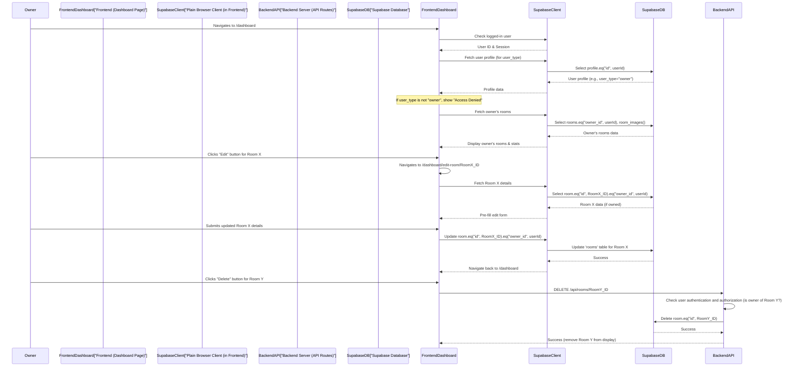

# Chapter 6: Room Owner Dashboard

Welcome back to `RoomFinder`! In our [previous chapter, "Saved Rooms Functionality"](05_saved_rooms_functionality_.md), you learned how users can keep track of their favorite room listings. Now, we're going to shift our focus to the other side of the marketplace: the **Room Owners**!

This chapter introduces the **Room Owner Dashboard**, a special "control center" designed just for them.

## What Problem Does This Solve?

Imagine you own several properties and list them on `RoomFinder`. You'd want a single place where you can:

*   See **all your rooms** at a glance.
*   Check important **statistics** about your listings (like how many are active).
*   **Add new rooms** when one becomes available.
*   **Update details** for an existing room (e.g., change the rent, add new photos).
*   **Remove a room** if it's no longer available.

The **Room Owner Dashboard** provides exactly this! It's like your personal "office space" within `RoomFinder`, giving you full control and insights into your properties.

Our central use case for this chapter is: **A room owner wants to quickly view all their listed properties, update a room's details, and add a new one, all from a single, easy-to-use interface.**

## Key Concepts: Your Property Command Center

To make managing rooms easy for owners, the dashboard focuses on these key ideas:

### 1. Dedicated Access

This dashboard is a private space. Only users who have registered as a "Room Owner" can access it. If you're a "Room Finder," you won't be able to see this page, keeping your experience focused on finding rooms. (Remember how we talked about `user_type` in [Chapter 3: User Authentication & Profiles](03_user_authentication___profiles_.md)? This is where it's used!)

### 2. Overview of Listings

The dashboard provides a clear list of all rooms owned by the logged-in user. Each room usually shows its main picture, title, location, price, and availability status.

### 3. Quick Stats

To give owners useful information at a glance, the dashboard also displays simple statistics, like the total number of rooms they have listed or their potential monthly income from active listings.

### 4. Direct Management Tools

Right next to each room, or at the top of the dashboard, owners have buttons to:
*   **Add New Room**: Go to a form to create a new listing.
*   **Edit Room**: Modify the details of an existing room.
*   **Delete Room**: Permanently remove a listing.

## How to Use the Room Owner Dashboard: A Guided Tour

Let's walk through how a room owner uses this powerful dashboard.

### Step 1: Accessing the Dashboard

A logged-in room owner navigates to the `/dashboard` page. The application first checks if they are indeed an "owner."

Here's a snippet from `app/dashboard/page.tsx` that performs this check and fetches the user's profile:

```typescript
// app/dashboard/page.tsx (simplified useEffect)
import { createClient } from "@/lib/supabase/client"
import { useRouter } from "next/navigation"
import { useEffect, useState } from "react"
import type { User } from "@supabase/supabase-js"

export default function DashboardPage() {
  const router = useRouter()
  const [user, setUser] = useState<User | null>(null)
  const [profile, setProfile] = useState<any>(null) // To store user type

  const supabase = createClient()

  useEffect(() => {
    const fetchData = async () => {
      const { data: { user: authUser } } = await supabase.auth.getUser()

      if (!authUser) {
        router.push("/auth/login") // Not logged in, redirect to login
        return
      }
      setUser(authUser)

      // Fetch user profile to get their user_type
      const { data: profileData } = await supabase
        .from("profiles")
        .select("user_type, first_name")
        .eq("id", authUser.id)
        .single()

      if (profileData) {
        setProfile(profileData)
      }
    }
    fetchData()
  }, [supabase, router])

  // ... (rest of the component) ...
}
```
In this code:
*   The `useEffect` hook runs when the page loads.
*   It uses `supabase.auth.getUser()` to check if *any* user is logged in. If not, they are sent to the login page.
*   If a user is logged in, it then fetches their `profile` from the database. This is crucial because the `profile` table stores the `user_type` ("owner" or "finder").

Further down in the `DashboardPage`, there's a check to make sure only owners can see the content:

```typescript
// app/dashboard/page.tsx (simplified access check)
// ... (imports and state as above) ...

  const isOwner = (user?.user_metadata?.user_type === "owner") || profile?.user_type === "owner"

  if (!user || !isOwner) {
    return (
      <main>
        {/* ... Denied access message and "Go Home" button ... */}
      </main>
    )
  }

  // ... (rest of the dashboard content if user is an owner) ...
```
This snippet ensures that if the user is not logged in (`!user`) or if their `user_type` is not "owner" (`!isOwner`), they see an "Access Denied" message instead of the dashboard. This is a simple but effective authorization check!

### Step 2: Viewing Your Listed Rooms

Once an owner accesses the dashboard, they'll see a list of all their rooms. The page fetches these rooms specifically linked to their user ID.

```typescript
// app/dashboard/page.tsx (simplified room fetching)
// ... (imports and state) ...

  useEffect(() => {
    const fetchData = async () => {
      // ... (authentication and profile fetching as above) ...

      // Only show rooms if user is an owner
      if (profileData?.user_type === "owner") {
        const { data: roomsData } = await supabase
          .from("rooms")
          .select(
            `
            *,
            room_images(image_url)
          `,
          )
          .eq("owner_id", authUser.id) // Fetch rooms owned by the current user
          .order("created_at", { ascending: false }) // Show newest first

        if (roomsData) {
          setRooms(roomsData)
        }
      }
      setIsLoading(false)
    }
    fetchData()
  }, [supabase, router])

  // ... (rest of the component JSX) ...
```
Here's the important part: `supabase.from("rooms").select(...).eq("owner_id", authUser.id)`. This query asks Supabase to retrieve all rooms where the `owner_id` column matches the `id` of the currently logged-in owner (`authUser.id`). This ensures that an owner *only* sees their own listings. It also fetches `room_images` along with the room details, so a preview image can be shown for each listing.

### Step 3: Adding a New Room

From the dashboard, there's a prominent "Add New Room" button. Clicking this button navigates the owner to the `/dashboard/add-room` page.

```typescript
// app/dashboard/page.tsx (simplified button)
<Link href="/dashboard/add-room">
  <Button>
    ✚ Add New Room
  </Button>
</Link>
```
The `/dashboard/add-room` page is where the owner fills out a form to create a new room listing. We explored this process in detail in [Chapter 2: Room Data Management API](02_room_data_management_api_.md), focusing on how a `POST` request creates the room.

### Step 4: Editing an Existing Room

Each room card on the dashboard has an "Edit" button. Clicking it takes the owner to a specific edit page, like `/dashboard/edit-room/room_id_123`.

```typescript
// app/dashboard/page.tsx (simplified edit button)
<Link href={`/dashboard/edit-room/${room.id}`}>
  <Button variant="outline">
    ✏️ Edit
  </Button>
</Link>
```
On the `app/dashboard/edit-room/[id]/page.tsx` page:
1.  The page first fetches the details of the specific room (`id` from the URL).
2.  It populates the form fields with the existing room data.
3.  The owner makes their changes and clicks "Save Changes."

Here's a simplified look at how `EditRoomPage` (`app/dashboard/edit-room/[id]/page.tsx`) fetches the room data and handles updates:

```typescript
// app/dashboard/edit-room/[id]/page.tsx (simplified useEffect and handleSubmit)
import { createClient } from "@/lib/supabase/client"
import { useParams, useRouter } from "next/navigation"
import { useEffect, useState } from "react"
import type { User } from "@supabase/supabase-js"

export default function EditRoomPage() {
  const params = useParams()
  const roomId = params.id as string // Get the room ID from the URL
  const router = useRouter()
  const [user, setUser] = useState<User | null>(null)
  const [formData, setFormData] = useState<any>({})
  // ... other state for images, loading, etc. ...

  const supabase = createClient()

  useEffect(() => {
    const fetchData = async () => {
      const { data: { user: authUser } } = await supabase.auth.getUser()
      if (!authUser) { router.push("/auth/login"); return }
      setUser(authUser)

      // Fetch the specific room details, including images
      const { data, error } = await supabase
        .from("rooms")
        .select(`*, room_images(id, image_url)`)
        .eq("id", roomId)
        .eq("owner_id", authUser.id) // IMPORTANT: Verify ownership
        .single()

      if (error || !data) { /* Handle error or room not found */ return }
      setFormData({ // Pre-fill form with existing data
        title: data.title, description: data.description, /* ... other fields ... */
      })
      // ... set imageUrls from data.room_images ...
    }
    fetchData()
  }, [roomId, supabase, router]) // Re-run if room ID or client changes

  const handleSubmit = async (e: React.FormEvent) => {
    e.preventDefault()
    // ... validation ...

    const { error: updateError } = await supabase
      .from("rooms")
      .update({ /* updated data from formData */ })
      .eq("id", roomId) // Update only this specific room
      .eq("owner_id", user?.id) // IMPORTANT: Ensure logged-in user is the owner

    if (updateError) { /* Handle error */ return }
    router.push("/dashboard") // Go back to dashboard after saving
  }

  // ... (JSX for the edit form) ...
}
```
Key points here:
*   When fetching room data, we use `.eq("owner_id", authUser.id)` to make sure the logged-in user actually owns the room they are trying to edit.
*   When submitting changes (`handleSubmit`), we again use `.eq("id", roomId).eq("owner_id", user?.id)` to ensure the update only happens for *their* room. This is robust authorization!
*   The actual `update` operation on the `rooms` table is handled directly by the Supabase client here, which then communicates with the database.

### Step 5: Deleting a Room

Next to the "Edit" button, there's often a "Delete" button. Clicking this will typically ask for confirmation before removing the room.

```typescript
// app/dashboard/page.tsx (simplified deleteRoom function)
// ... (imports and state) ...

  const deleteRoom = async (roomId: string) => {
    if (confirm("Are you sure you want to delete this room? This action cannot be undone.")) {
      try {
        const response = await fetch(`/api/rooms/${roomId}`, { method: "DELETE" }) // Call the DELETE API
        if (response.ok) {
          setRooms(rooms.filter((r) => r.id !== roomId)) // Remove from UI if successful
        } else {
          console.error("Failed to delete room:", await response.json())
        }
      } catch (error) {
        console.error("Error deleting room:", error)
      }
    }
  }

  // ... (JSX for the delete button) ...
  <Button onClick={() => deleteRoom(room.id)}>
    🗑️ Delete
  </Button>
```
In this code, the `deleteRoom` function makes a `fetch` request to our backend API at `/api/rooms/[id]` using the `DELETE` HTTP method. As we learned in [Chapter 2: Room Data Management API](02_room_data_management_api_.md), this API endpoint is responsible for securely deleting the room from the database, after verifying that the requesting user is the actual owner. If successful, the room is removed from the dashboard's display.

## Under the Hood: The Dashboard Flow

Let's visualize the main actions an owner takes on their dashboard.



This diagram illustrates how the `FrontendDashboard` orchestrates the display and management actions. For *fetching* and *updating* specific room data on the edit page, the `Plain Browser Client` directly interacts with Supabase, relying on Supabase's built-in security to enforce ownership. For *deleting* a room, it uses a `DELETE` request to a backend API route, which provides another layer of server-side validation before touching the database.

## Summary of Room Owner Dashboard Features

| Feature           | Description                                                                     | Frontend Components Involved                            | Underlying Mechanism                                                                                                                                                             |
| :---------------- | :------------------------------------------------------------------------------ | :------------------------------------------------------ | :----------------------------------------------------------------------------------------------------------------------------------------------------------------------- |
| **Access Control** | Ensures only authenticated "owner" users can view the dashboard.                | `app/dashboard/page.tsx`                                | Checks `user_type` from `profiles` table (fetched via [Plain Browser Client](01_supabase_client___auth_management_.md)). If not owner, redirects or denies access.              |
| **View All Listings** | Displays a list of all rooms owned by the current user.                         | `app/dashboard/page.tsx`                                | Fetches data from `rooms` table using `supabase.from("rooms").select().eq("owner_id", userId)` via [Plain Browser Client](01_supabase_client___auth_management_.md).         |
| **Statistics**    | Shows summary stats like total listings and potential income.                   | `app/dashboard/page.tsx`                                | Calculated from the fetched list of owner's rooms on the frontend.                                                                                                       |
| **Add New Room**  | Navigates to a form for creating a new room listing.                            | `app/dashboard/page.tsx` (button) -> `app/dashboard/add-room/page.tsx` | Button link. `app/dashboard/add-room/page.tsx` handles `POST /api/rooms` as detailed in [Chapter 2: Room Data Management API](02_room_data_management_api_.md).                |
| **Edit Room**     | Navigates to a form to modify an existing room's details.                       | `app/dashboard/page.tsx` (button) -> `app/dashboard/edit-room/[id]/page.tsx` | Button link. `app/dashboard/edit-room/[id]/page.tsx` fetches room data, then `PUT` updates `rooms` table via [Plain Browser Client](01_supabase_client___auth_management_.md). Ownership is enforced. |
| **Delete Room**   | Removes a room listing permanently from the platform.                           | `app/dashboard/page.tsx` (button)                       | Calls `DELETE /api/rooms/[id]` backend API. The API verifies ownership before deleting, as discussed in [Chapter 2: Room Data Management API](02_room_data_management_api_.md). |

## Conclusion

In this chapter, you've explored the **Room Owner Dashboard** – the central control panel for users who list properties on `RoomFinder`. We learned how it provides a dedicated, secure space for owners to view their listings, get quick statistics, and directly manage their properties by adding, editing, and deleting rooms. Crucially, we saw how robust authentication and authorization checks (leveraging `user_type` and `owner_id`) are implemented to ensure owners only interact with their own properties.

You now understand how `RoomFinder` empowers its room owners. Next, we'll dive into how to build efficient and consistent user interfaces using reusable building blocks.


# THANK YOU FOR WATCHING! ❤️

---