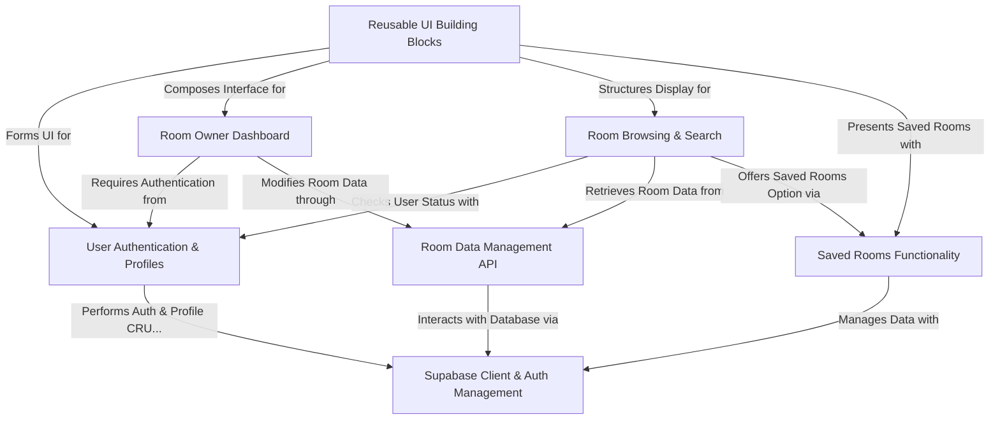

# Tutorial: RoomFinder

RoomFinder is a platform that helps users **discover and manage room rentals**. It allows people looking for a place to **browse available rooms with powerful search and filter options**, and even **save their favorite listings** for later. Room owners can easily **list, update, and manage their properties** through a dedicated dashboard, all powered by a secure Supabase backend.

## Visual Overview

## Chapters

1. [Supabase Client & Auth Management
](01_supabase_client___auth_management_.md)
2. [Room Data Management API
](02_room_data_management_api_.md)
3. [User Authentication & Profiles
](03_user_authentication___profiles_.md)
4. [Room Browsing & Search
](04_room_browsing___search_.md)
5. [Saved Rooms Functionality
](05_saved_rooms_functionality_.md)
6. [Room Owner Dashboard
](06_room_owner_dashboard_.md)
7. [Reusable UI Building Blocks
](07_reusable_ui_building_blocks_.md)

---